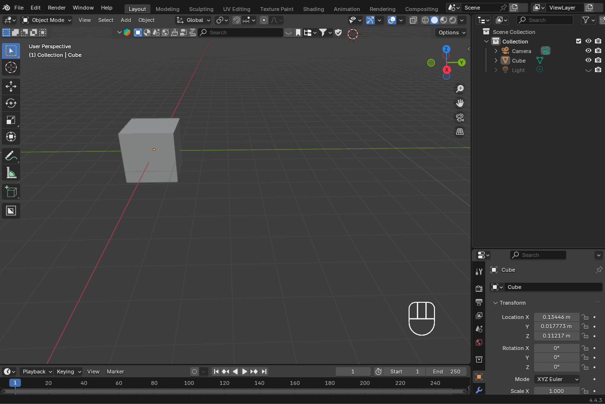
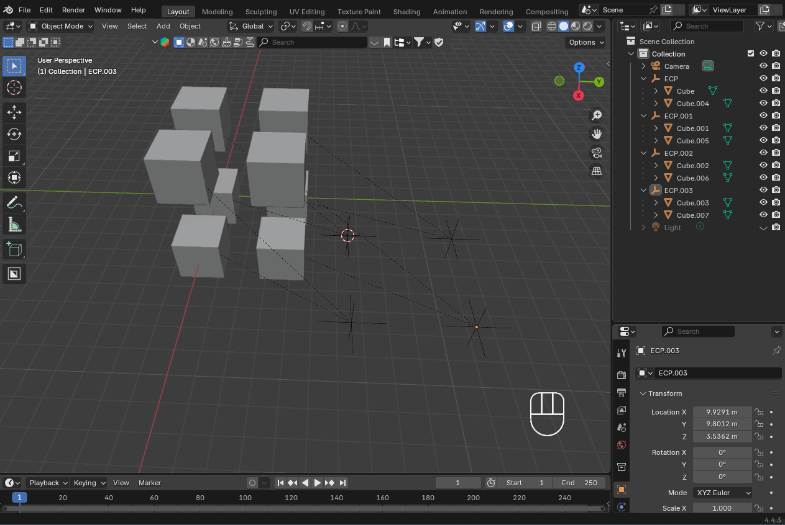
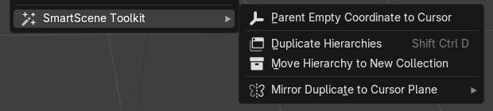
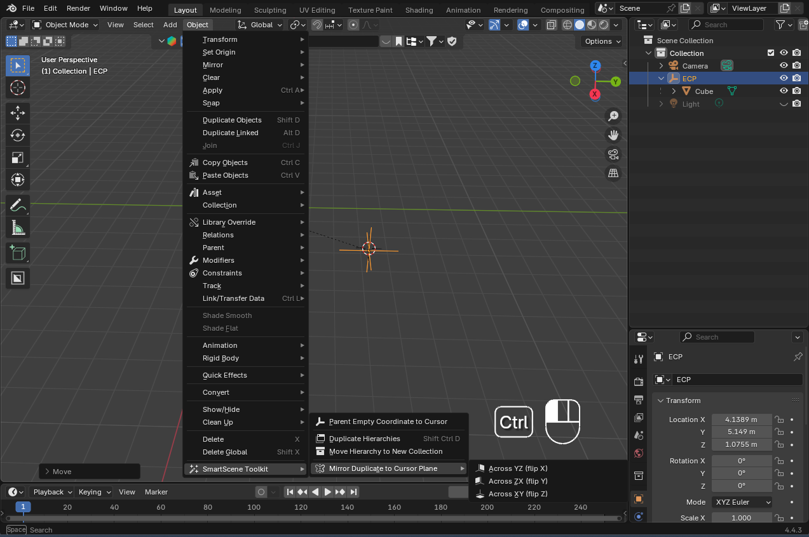

# SmartScene Toolkit (Community Edition)

> Efficient Blender add-on toolkits to enhance hierarchy manipulation, mirroring, and scene organization.
> 
> 

## 1. 🧩Included Add-ons

| Name | Description |
|------|-------------|
| **Parent to Cursor** | Create an Empty at the cursor and parent all selected hierarchies to it. |
| **Hierarchy Duplicate** | Duplicate complex hierarchies with multiple parents, preserving structure. |
| **Move Hierarchy to New Collection** | Move selected objects and all children into a new or named collection. |
| **Mirror to Cursor** | Mirror-duplicate selected objects/hierarchy across a plane at the 3D cursor. |
| **Mirror to Cursor Edit** | In edit mode, mirror-duplicate selected geometry across a plane at the 3D cursor.|

## 2. 🎥Demonstration

#### ● 2.1 Mirror to Cursor

#### ● 2.2 Duplicate Hierarchy

#### ● 2.3 Move Hierarchy to New Collection

#### ● 2.4 Mirror to Cursor

#### ● 2.5 Mirror to Cursor Edit

**... More are on the way!**

## 3. 🔧Installation

Open source version:
1. Download the `.py` file(s) you want.
2. Open Blender → *Edit > Preferences > Add-ons > Install*
3. Select the `.py` file, then enable it in the list.

Premium version (coming soon):

## 4. 📋Usage

Each add-on adds its feature to the **right-click menu** (object context menu) in **Object Mode** or **Edit Mode**.

Examples:
- **Mirror to Cursor**: Right-click → *Mirror Duplicate to Cursor Plane*
- **Mirror to Cursor Edit**: Tab to edit mode → Right-click → *Mirror Duplicate to Cursor Plane (Edit Mode)*
- **Move Hierarchy to New Collection**: Right-click → *Move Hierarchy to New Collection*

## 5. 💡Pro / Premium Version (Coming soon)

A **premium version** with:
- All in one add-on with all features
- Top and right-click menu integration, some support shortcuts
- Optimized performance for large scenes
- UX polish
- Future update support

## 6. 📜License

GPL-3.0-or-later License (for the community edition).

