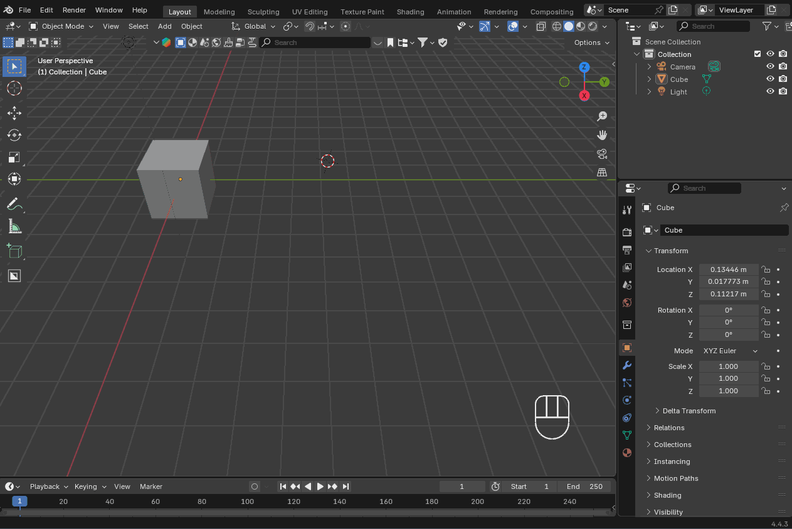
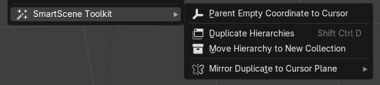

# SmartScene Toolkit (Blender Add-ons)

Efficient Blender toolkits collection add-on to enhance hierarchy manipulation, mirroring, and scene organization.

## 🧩 Included Add-ons

| Name | Description |
|------|-------------|
| **Parent to Cursor (ECP)** | Create an Empty at the cursor and parent all selected hierarchies to it. |
| **Hierarchy Duplicate (Multi-parent)** | Duplicate complex hierarchies with multiple parents, preserving structure. |
| **Move Hierarchy to New Collection** | Move selected objects and all children into a new or named collection. |
| **Mirror to Cursor** | Mirror-duplicate selected objects/hierarchy across a plane at the 3D cursor. |
| **Mirror to Cursor Edit** | In edit mode, mirror-duplicate selected geometry across a plane at the 3D cursor.|

---

## 🎥 Demonstration

#### Mirror to Cursor

#### Duplicate Hierarchy

---

## 🔧 Installation

Open source version:
1. Download the `.py` file(s) you want.
2. Open Blender → *Edit > Preferences > Add-ons > Install*
3. Select the `.py` file, then enable it in the list.

Premium version:
1. Download the `.zip` file.
2. Open Blender → *Edit > Preferences > Add-ons > Install*
3. Select the `.zip` file, then enable it in the list.

---

## 📋 Usage

Each add-on adds its feature to the **right-click menu** (object context menu) in **Object Mode** or **Edit Mode**.

Examples:
- **Mirror to Cursor**: Right-click → *Mirror Duplicate to Cursor Plane*
- **Mirror to Cursor Edit**: Tab to edit mode → Right-click → *Mirror Duplicate to Cursor Plane (Edit Mode)*
- **Move Hierarchy to New Collection**: Right-click → *Move Hierarchy to New Collection*

---

## 💡 Pro / Premium Version (Coming soon)

A premium version with:
- Advanced features (custom axes, batch automation, undo layers)
- Optimized performance for large scenes
- UX polish and configuration options
- Future update support

---

## 📜 License

CC BY-NC 4.0 License (for the free version).  
Please credit **Tianle Yuan** if you use or modify.

